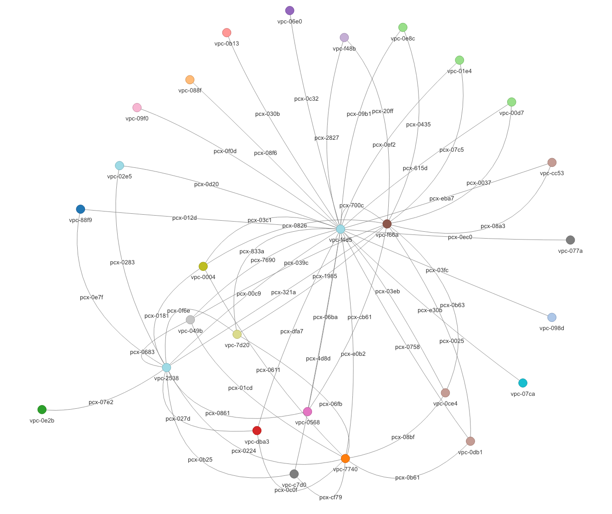

# AWS VPC Peering Connections Visualization

This script visualizes AWS VPC peering connections in a network graph format. It uses data from an AWS Config aggregator query, processes it, and then generates a graph representation of the VPC peering connections between different VPCs on different AWS accounts and regions.

Here's an example graph visualization generatated by this script:


## Prerequisites

To use the tool, you need to have AWS Config set up with the appropriate resources and permissions, as the graph is built based on the Config resource data.

Make sure that:

1. AWS Config has been enabled on all accounts you want to graph data from
2. AWS Config is configured to record VPC Peering Connections
3. An organization-wide Config aggregator has been created 

You can see how to setup Config from this [Blog post](https://aws.amazon.com/blogs/mt/org-aggregator-delegated-admin/) and from the [Developer guide](https://docs.aws.amazon.com/config/latest/developerguide/getting-started.html)

## Usage

1. Query the Config aggregator for VPC peering data, AWS Config > Advanced Queries > Query editor
```SQL
SELECT
  accountId,
  resourceId,
  configuration
WHERE
  resourceType = 'AWS::EC2::VPCPeeringConnection'
```
2. Go to the last page of the results and export the data as JSON
3. Clone the repository and install required packages
```bash
git clone https://github.com/toffmee/aws-vpc-peerings-graphed.git
cd aws-vpc-peerings-graphed
python -m venv venv
source venv/bin/activate
pip install -r requirements.txt
```
4. Move the exported Config JSON to the folder and name it as `vpc_peering_data.json`
5. Run the script
```bash
python main.py --accounts <account_id_1,account_id_2,...> --regions <region_1,region_2,...>
```
The arguments `--accounts` and `--regions` arguments are opional, they can be used together or separately and they are used to filter the data used to generate the graph. To include all data from the JSON just omit both arguments.

6. View the generated graph `vpc_peering_visualization.html` in a browser